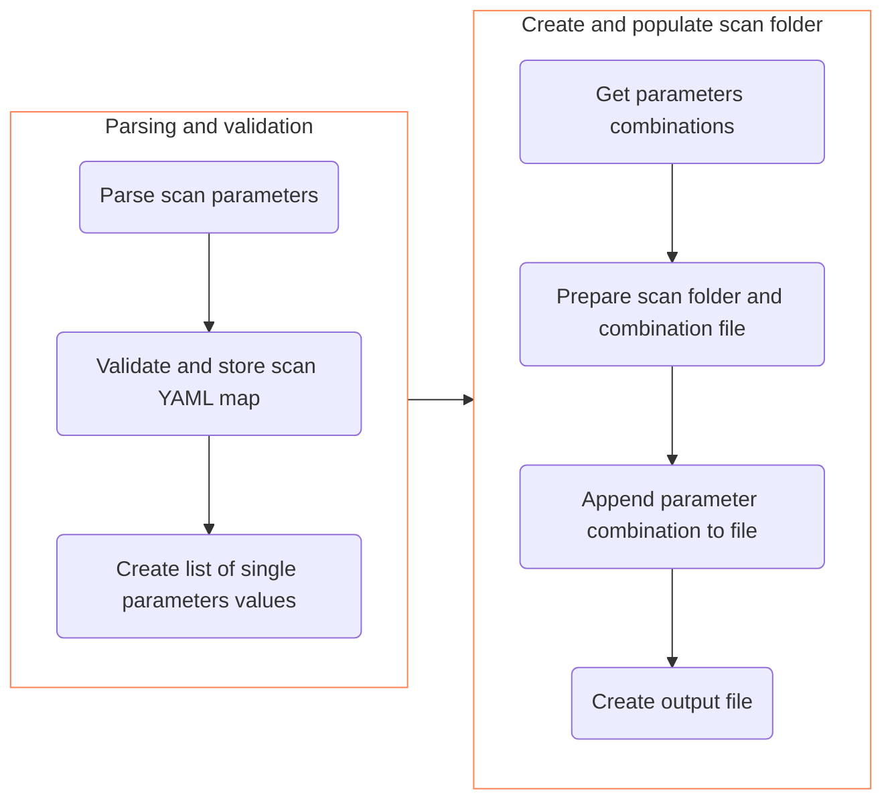

# Design of parameter scans

!!! info "Reading the code is always encouraged"
    Reading the code starting from the main script and following the function calls will probably already give a good overview of how the `parameter-scan` mode is implemented.
    However, a couple of comments might help understanding the workflow and the rationale behind it.

<div align="center">



</div>

!!! note "Premature optimization is the root of all evil. - Donald Knuth"
    The present implementation of the `prepare-scan` mode might appear not that clever, since many intermediate parsing and storing lead to e.g. iterating over the same arrays many times.
    On the same line, probably some `yq` invocation might be spared by combining more operation in the same call.
    However, this has been done on purpose trying to always prefer clearer code over _claimed_ speed in the very first implementation.
    Out of the box, generating a scan with few hundreds parameters combinations takes few seconds on an average laptop and it is reasonable to believe that this is an acceptable performance.

## Lack of multi-dimensional arrays

In Bash it is not possible to have an array as entry of another array.
However, for the parameter scan, it is needed to somehow store a list of parameters, each with a list of possible values and this would be a natural usage of a two-dimensional array.

By design, scan parameters must have either boolean or numerical value and this also means that they do not contain spaces.
Hence, it is possible to store a list of values as a single string and then use word splitting to e.g. create an array out of it with values stored as separate entries.

```console title="Proof of concept"
$ list="1 2 3"
$ array=( ${list} ) # This expansion must be unquoted to let word splitting act
$ printf '%s\n' "${array[@]}"
1
2
3
```

The same trick is used to store the list of scan parameters.
This is possible because the YAML keys happen not to have spaces in them.

!!! danger "Spaces in YAML key or values would break the implementation"
    Since **we rely on word splitting to correctly split values or parameter names**, this would be automatically broken if spaces were part of values, since word splitting would then split a single value in different ones.
    If having spaces in keys or values turns out to be a need, some more involved implementation is required.

## Interplay between Bash and YAML

The scan information in the configuration file must be parsed into Bash variables and the first aspect to deal with is the fact that the user is free to use YAML syntax in its full glory.
For example, sequences can be specified using square brackets or an explicit list.
We do not want to deal this ambiguity on the Bash side and therefore we make sure that everything is stored in the same way.
The `yq` tool offers a way to print out sequences in a compact form.

```console title="Enforcing compact style reading out YAML sequences"
$ echo $'- 17\n- 42\n- 666'
- 17
- 42
- 666
$ yq '.. style="flow"' <<< $'- 17\n- 42\n- 666'
[17, 42, 666]
```

This is used both when parsing the `Scan_parameters` key and when parsing each parameter values.

## Storing scan parameters values

Before having a list of values for each scan parameter, its scan YAML map has to be extracted from the handler configuration file and then parsed to generate the list of values.
This might be done in a single swipe but would make it basically impossible to later add sampling algorithms that need to consider all scan parameters at the same time to produce their list of values (e.g. Latin Hypercube Sampling).
Therefore the scan YAML maps are first stored and then used at a later point to produce the list of values of each parameter.

A single Bash associative array has been chosen for this purpose.
Its keys are the parameters stored as a period-separated list of YAML keys as they appear in the hybrid handler configuration file, and precisely in the 'Software_keys' sections.
The value of each array entry is, in a first phase, the YAML scan map.
Later, this is replaced by a string containing a list of parameter values.
In this case a YAML sequence style is kept, i.e. with squares and commas.

=== "Final content"

    ``` {.bash .no-copy title="Example of parameter values array"}
    list_of_parameters_values=(
        ['IC.Software_keys.Modi.Collider.Sqrtsnn']='[4.3, 7.7]'
        ['Hydro.Software_keys.etaS']='[0.13, 0.15, 0.17]'
    )
    ```

=== "First phase"

    ``` {.bash .no-copy title="Example of parameter values array"}
    list_of_parameters_values=(
        ['IC.Software_keys.Modi.Collider.Sqrtsnn']='{Values: [4.3, 7.7]}'
        ['Hydro.Software_keys.etaS']='{Values: [0.13, 0.15, 0.17]}'
    )
    ```

## Generating all possible combinations

Technically speaking, this is straightforward in Bash, thanks to the built-in brace expansion.

=== "Example of brace expansion"

    ```console
    $ printf '%s\n' {a,b,c}_{1,2}
    a_1
    a_2
    b_1
    b_2
    c_1
    c_2
    ```

=== "Order of expansion"

    ```console
    $ var="{a,b,c}_{1,2}"
    $ printf '%s\n' ${var}
    {a,b,c}_{1,2}
    ```

=== "Workaround using eval"

    ```console
    $ var="{a,b,c}_{1,2}"
    $ eval printf '%s\\\n' "${var}"
    a_1
    a_2
    b_1
    b_2
    c_1
    c_2
    ```

However, the Bash shell expansion mechanism works in a way such that brace expansion happens **before** variables expansion.
To make brace expansion act on a string that is contained in a variable requires using `eval`, which is always delicate, because it might open up to security flaws like enabling code injections.
In this case the strings passed to it are validated and guaranteed to be numbers only, though.

!!! danger "Allowing string values requires action here!"
    If at some point it is needed to support scans on parameter of string type, a different approach should be probably used to generate all combinations.
    Probably, as it is, the code would also break in case of spaces into the strings.
