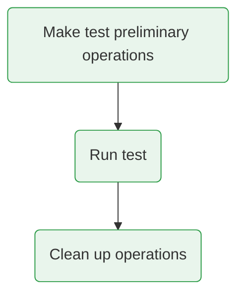

# A smart tests runner

In the :file_folder: **tests** folder there is a :simple-gnubash: `tests_runner` executable, which shall be used to run tests.
This can be run with the `--help` command line option to obtain a self-explanatory helper message.

Using the test runner it is possible to either run **unit** or **functional** tests.
This is achieved via a first positional argument.
By default all available running tests are run and a detailed report is printed to the standard output.
However, it is possible to only get a list of tests, run some of them, decrease the verbosity of the report and/or explicitly ask to keep the produced output files.

=== "Running all tests"
    ```bash
    # Run unit tests
    ./tests_runner unit
    # Run functional tests
    ./tests_runner functional
    ```

=== "Running some tests"
    ```bash
    # Get list of available unit tests
    ./tests_runner unit -t
    # Run tests 3 to 7 and 10
    ./tests_runner unit -t '3-7,10'
    ```

=== "Keeping output files"
    ```bash
    ./tests_runner unit -k
    ```

Tests output files are created in the :file_folder: **tests/run_tests** folder and each test creates an own sub-folder.
If all tests pass, the output folder is automatically deleted, unless differently asked.
However, if at least one test fails, the output folder is kept to allow to investigate the failure.
The :material-file: *tests_runner.log* can be found inside it and this is a good starting point to check out what happened.

!!! tip "A handy command for development"
    From time to time it will happen that a test has to be run many times and the runner log file inspected, for example because something does not work as expected.
    It is helpful to check out the test number and run it in the following way (from the :file_folder: **tests** folder),
    ```bash
    ./tests_runner unit -k -t 42 || less -rf run_tests/tests_runner.log
    ```
    where `||` can be substituted by `;` if it is desired to always have a look to the log file, i.e. also if the test passes.

!!! info "All output folders are kept by default"
    When asking to keep the tests output folder, it might happen that a :file_folder: **tests/run_tests** already exists (because of a previous run).
    The runner will automatically create a new one, renaming the older one with a timestamp prefix referred to when the renaming has taken place.
    If tests are run many times always keeping the output folders, for example during development, at some point these might be _too many_.
    **It is totally safe to delete them.**
    You can do it with a simple command like `rm -r run_tests*` from the :file_folder: **tests** folder.

## How can I use the test framework and what should I know?

In order to be allow the runner take over most of the overhead and be as user-friendly as possible, some discipline from the developer is requested and the following few mechanisms should be understood and respected.

!!! info "Filenames must have a given prefix!"
    Since the runner automatically looks for tests, these have to be put in filenames with a given prefix **and with the `.bash` extension**.

    * Unit tests are recognized as such only if put in files matching `unit_tests_*.bash` globbing expression.
    * Functional tests are recognized as such only if put in files matching `functional_tests_*.bash`.
    * Tests put in other files are totally ignored by the runner.

In general any test has a setup-run-teardown flow, which is automatically enforced by the runner.

<div align="center">



</div>

The developer can decide what should be done in each phase and the runner will implicitly understand whether anything has to be done in each phase simply from the presence or absence of Bash functions with a given name.
The existence of a test and its name is automatically deduced from the function to run it, which has to follow a given pattern (see examples below).
If such a function exists, the runner will check for existence of the corresponding setup and teardown functions, invoking them before and after the test, respectively, if existing.

=== "Setup function"
    ```bash
    function Make_Test_Preliminary_Operations__test-name()
    {
        # Test preliminary operations
    }
    ```

=== "Unit test function"
    ```bash
    function Unit_Test__test-name()
    {
        # Unit test code
    }
    ```

=== "Functional test function"
    ```bash
    function Functional_Test__test-name()
    {
        # Functional test code
    }
    ```

=== "Teardown function"
    ```bash
    function Clean_Tests_Environment_For_Following_Test__test-name()
    {
        # Test clean up operations
    }
    ```

!!! tip "Use the framework functionality to invoke code to test"
    * Codebase functions to be invoked in unit tests should be called through the `Call_Codebase_Function` and `Call_Codebase_Function_In_Subshell` interface functions (passing the name of the function to be invoked as first argument and the arguments to be forward afterwards).
    *  In functional tests you'll probably want to run the hybrid handler with some options and this can be easily achieved by using the `Run_Hybrid_Handler_With_Given_Options_In_Subshell` function.

!!! note "The Bash behavior of the tests runner"
    The shell `errexit` option is not enabled in the tests runner and, therefore, its Bash behavior when running tests is not the same as when running the handler.
    This is a natural choice in a testing framework where the error handling is wished to be done by hand to e.g. count failures and build up a report about failed tests.
    However, the `errexit` mode is enabled when running the codebase functions, otherwise the real behavior of the handler code would not be tested!

!!! warning "Each test is run in its own subshell"
    The full test flow, including setup and teardown, is run in a subshell in order to isolate its changes from the external environment.
    In this way tests should not interfere with each other and the developer should be aware of this aspect.
    For example, if the same setup operations are needed in different tests, they should be repeated for every test, but this can be easily achieved e.g. by letting a setup function invoke that of a different test.

!!! danger "No space must occur before the `function` keyword"
    Although enforced by the formatter, it might happen that some spaces are put bofere the `function` Bash keyword in the function defining a test.
    If this is done, the test will not be recognized by the runner.
