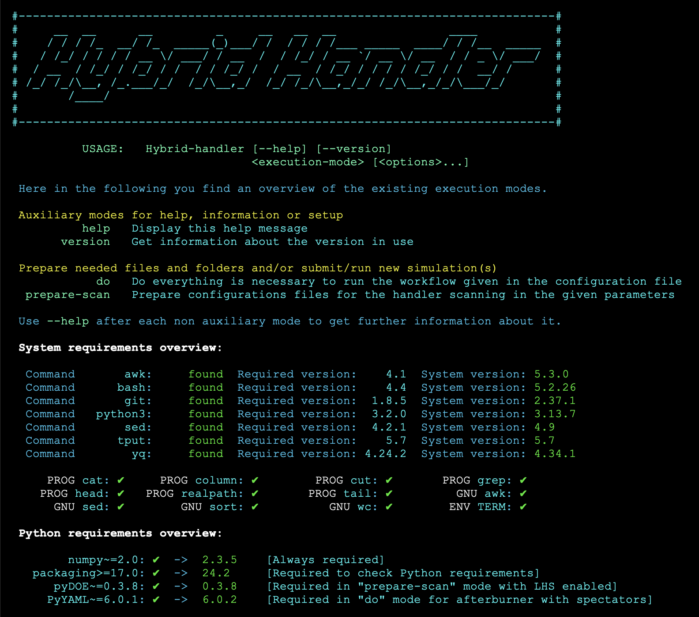

---
hide:
  - navigation
  - toc
---

# A unique wonderful tool

The Hybrid-handler is a :simple-gnubash: **Bash script** and therefore it does not need any installation.
After cloning the repository or downloading the source code attached to a release, you can simply run the `Hybrid-handler` script[^1].

[^1]: Be aware, that this might not work straightaway if only a very old Bash installation is available on your OS.
      However, if your Bash version is `4.x` or higher, the main script will be able to give you a complete overview of system requirements.

## I wanna run the tool **NOW** – what should I do?

!!! warning "Sure, give it a try, but with awareness &ensp; :four_leaf_clover:"

    Reading (part of) the user guide is encouraged not only to get acquainted with how the Hybrid-handler works, but also to discover what it has to offer you. Here in the following you find a very minimal quick-start, that might work out straightforwardly, but that might also fail depending on your setup. Please, refer to the user guide for further information.

??? note "The very first steps"

    ```bash
    $ git clone https://github.com/smash-transport/smash-vhlle-hybrid.git
    # some standard output (1)
    $ ./smash-vhlle-hybrid/Hybrid-handler
    # A nice, colorful report about system requirements (2)
    ```

    1. Git will clone using HTTPS protocol and locally create a :file_folder: ***smash-vhlle-hybrid*** folder.
    2. :warning: At this point you will discover whether your OS is ready to go. If it is, you will see green version numbers and green ticks :white_check_mark: as in the image shown here below. If you see some red version number or red cross :x:, you need to install or update the corresponding requirement. 

??? abstract "Setting up your run once the OS is ready"

    ```bash hl_lines="5 6"
    # Make sure all the software to be installed is compiled/installed (1)
    $ mkdir my-first-hybrid-run
    $ cp smash-vhlle-hybrid/configs/predef_configs/config_TEST.yaml my-first-hybrid-run/hybrid.yaml
    $ cd my-first-hybrid-run
    $ SMASH_EXE='/path/to/smash'; HYDRO_EXE='/path/to/vHLLE'; SAMPLER_EXE='/path/to/hadron-sampler' # (2)!
    $ sed -i -e "s|/path/to/smash|${SMASH_EXE}|g" -e "s|/path/to/vHLLE|${HYDRO_EXE}|g" -e "s|/path/to/hadron-sampler|${SAMPLER_EXE}|g" hybrid.yaml
    # Optionally check that the replacement has happened correctly
    $ grep 'Executable:' hybrid.yaml # (3)!
    ```

    1. :bulb: You will need to hand over the path to each executable to the Hybrid-handler through its configuration file, which we are setting up next.
    2. :pencil: You need to replace these three paths to the actual three paths to your software:exclamation:
    Alternatively to run these two highlighted lines, you can simply open the :material-file: _hybrid.yaml_ file and specify the paths there by hand at the 4 `Executable:` keys.
    3. This should print the four executable paths in the `IC`, `Hydro`, `Sampler`, `Afterburner` order.

??? tip "Running everything!"

    ```bash
    # From your my-first-hybrid-run folder
    $ ../smash-vhlle-hybrid/Hybrid-handler do -c hybrid.yaml --id Test_Run
    # The Hybrid-handler output will be displayed here (1)
    ```

    1. If everything succeeds a :file_folder: ***Test_Run*** will be created and inside it a dedicated folder per stage will contain among other files the output of that stage. :tada:

## User guide table of content

<div class="grid cards" markdown>

-   :white_check_mark:{ .lg .middle } &nbsp; __Are you ready to go?__

    ---

    Software for the desired simulation stages as well as some OS utilities need to be installed.

    [:material-arrow-right-box:&nbsp; Requirements](prerequisites.md)

-   :sunrise_over_mountains:{ .lg .middle } &nbsp; __What's the main idea?__

    ---

    Everything can be done using a handy script with different execution modes.

    [:material-arrow-right-box:&nbsp; The Hybrid-handler main script](execution_modes.md)

-   :screwdriver:{ .lg .middle } &nbsp; __Wanna run?__

    ---

    Build your configuration file to use the Hybrid-handler according to your needs.

    [:material-arrow-right-box:&nbsp; The configuration file](configuration_file.md)

-   :bulb:{ .lg .middle } &nbsp; __Let's try it out!__

    ---

    If you want to make a test run or get inspired, predefined setups are available.

    [:material-arrow-right-box:&nbsp; The predefined configuration files](predefined_configs.md)

-   :material-barcode-scan:{ .lg .middle } &nbsp; __Changing parameters__

    ---

    Preparing simulations scanning over one or more parameters is straightforward.

    [:material-arrow-right-box:&nbsp; Specifying parameters scans](scans_syntax.md)

-   :clipboard:{ .lg .middle } &nbsp; __Notable changes__

    ---

    Check out the CHANGELOG to get insights on the changes between versions.

    [:material-arrow-right-box:&nbsp; The CHANGELOG](CHANGELOG/index.md)

-   :question:{ .lg .middle } &nbsp; __Questions?__

    ---

    Check out our FAQ section. If needed, feel free to open an issue in the codebase repository.

    [:material-arrow-right-box:&nbsp; Frequently asked questions](FAQ/index.md)

-   :whale:{ .lg .middle } &nbsp; __Run it in a Docker container__

    ---

    Check out our Ubuntu-based Docker image to install software and use the handler.

    [:material-arrow-right-box:&nbsp; Shipped Docker image](docker_image.md)

</div>
